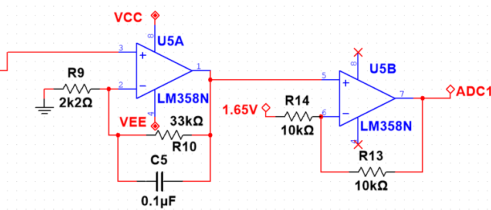
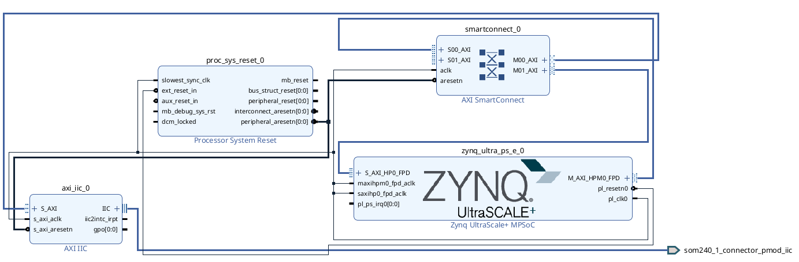
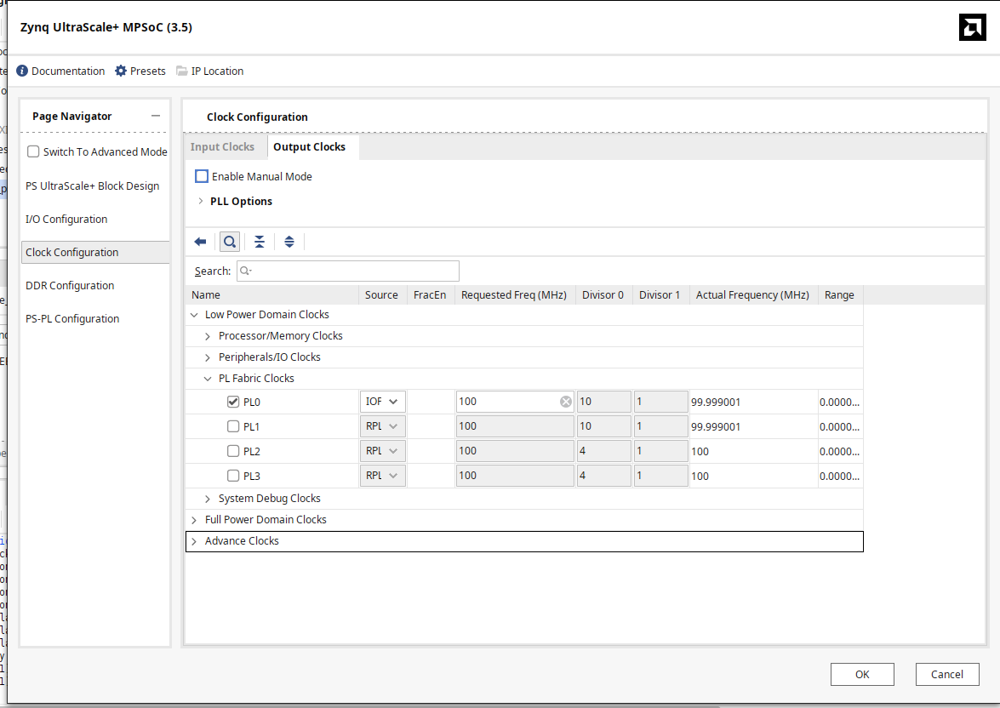
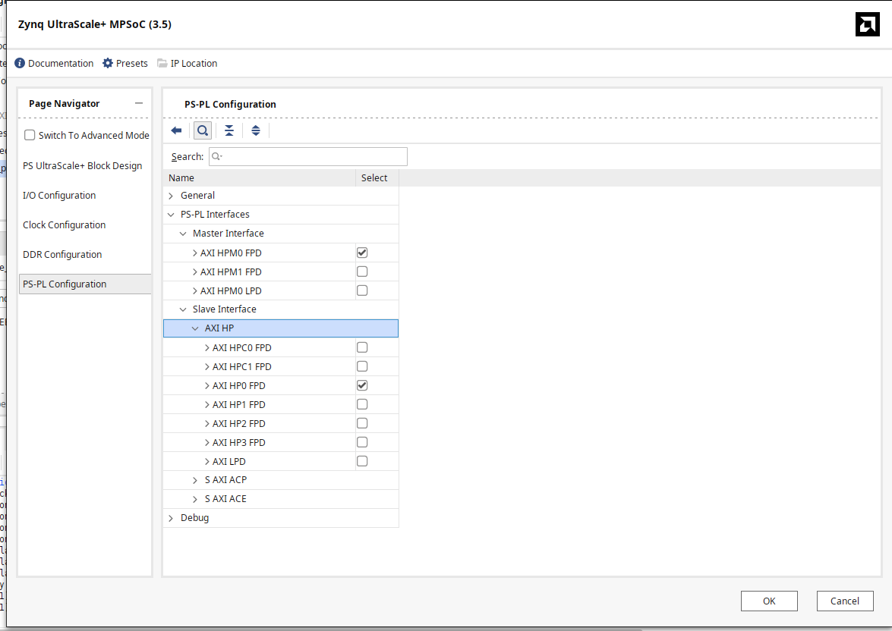
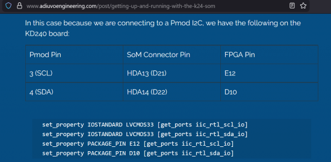

***Requirement*** : Signal acquisition requirements vary significantly depending on the application. For medical-grade systems, where even minute variations must be captured for diagnosis and observation, the acquisition setup becomes highly precise, expensive, and complex.

However, for our application—EEG in a Brain-Computer Interface (BCI)—the requirements are comparatively relaxed.

TL;DR: The signal quality only needs to be good enough to distinguish meaningful patterns from noise.

***Equipment***
The overall list of equipment outside of FPGA and simulation environment are:

| SN | Component  | Quantity        | Use Case           |
| :- | :--------- | :-------------- | :----------------- |
| 1  | AD620      | 4               | Gain               |
| 2  | LM358      | 4               | Gain and filtering |
| 3  | Resistors  | As many or less | Filtering          |
| 4  | Capacitors | 10uF and 0.1uF  | Filtering          |

The overall idea here is to amplify the electrical activity of brain that is usually in the range of 10 to 50 micro volts in to a range such that ADC can recognize the signals. Normally for signals with higher activity of signals relative to noise a single stage of gain would be enough, however concerning our application, the noise is significantly stronger relative to the signal, hence gain amplified in a single stage would lead us to a situation where we lose the signal(or at least most of signals). Hence the gain amplification is done in two stages. The first stage uses an Instrumentation Amplifier(IA) AD620 to amplify the signal 50 times. The formula is:

					G = 1 + \frac{49.4\,\text{k}\Omega}{R_G}

The immediate output of IA is interfaced with a 0.49Hz HPF filter to handle DC offset values. The remaining gain as well as the filtering of this is done using LM358 interfaced with 33k Ohm, 2k2 Ohm resistors and a 0.1uF ceramic capacitor. The next stage will be shifting of signals, this is done with an offset of 1.65V with the output of LM358.

Lets break this hardware setup step by step:

1. Instrumentation Amplifier Gain.
   
   FigA1: Instrumentation amplifier Gain with 0.49Hz HPF

2. Second Stage Gain & Filtering with DC shift
   
   FigA2: LM358 Gain and Filtering with DC shift

Four circuits of A1 and A2 are constructed, and hence we will have four adc outputs corresponding to the c3, c4, cz and forehead according to [[10-20 system]] in [[BCI]].

Then the following design was made in Vivado, since the Pmod ad2 is an IIC based device the design was constructed using an AXI IIC, the IIC interface was connected to AXI SmartConnect which was connected to Zynq.



Steps:

1. Place Zynq IP and run block automation
2. Configure the PL clock and PS-PL configurations




3. Place AXI smart Connect and AXI IIC and then run Connect Automation
4. Check the documentation for what port you are using to interface ADC and write .xdc file based on that, I used PMOD J2 and my ports where E12 and D10.



```
# I2C Clock (SCL)
set_property PACKAGE_PIN E12 [get_ports som240_1_connector_pmod_iic_scl_io]
set_property IOSTANDARD LVCMOS33 [get_ports som240_1_connector_pmod_iic_scl_io]
set_property PULLUP true [get_ports som240_1_connector_pmod_iic_scl_io]

# I2C Data (SDA)
set_property PACKAGE_PIN D10 [get_ports som240_1_connector_pmod_iic_sda_io]
set_property IOSTANDARD LVCMOS33 [get_ports som240_1_connector_pmod_iic_sda_io]
set_property PULLUP true [get_ports som240_1_connector_pmod_iic_sda_io]
```

5. Press F6 to validate the design and then tweak the parameters as suggested.
6. Create HDL Wrapper and Generate Bitstream
7. Export the hardware we require .hwh and .bit extension (For PYNQ we need the name of both .hwh and .bit file to be the same)
8. Add this to your Jupyter Notebook File

```python
from pynq import Overlay  
import numpy as np  
import cffi  
import csv
import time
  
# Load overlay  
overlay = Overlay("YOUR_FILENAME.bit")  
  
# Access IIC  
iic = overlay.axi_iic_0


# Initialize cffi and I2C interface
ffi = cffi.FFI()
# iic should be initialized in your environment
# Example: iic = SomeI2CDriver(port=1)

ADC_ADDR = 0x28  # AD7991 I2C address
VREF = 3.3       # Reference voltage
CSV_FILE = 'adc_data.csv'

def read_raw(addr, length=8):
    """Read 'length' bytes from ADC over I2C"""
    buf = ffi.new("unsigned char[]", length)
    try:
        iic.receive(addr, buf, length)
        return [buf[i] for i in range(length)]
    except Exception as e:
        print("Read error:", e)
        return None

def convert_ad7991(raw_bytes, Vref=3.3):
    """Convert raw AD7991 bytes to 4-channel voltages"""
    if raw_bytes is None or len(raw_bytes) != 8:
        return None
    voltages = []
    for i in range(0, 8, 2):  # 2 bytes per channel
        word = (raw_bytes[i] << 8) | raw_bytes[i+1]
        adc_val = word >> 4  # 12-bit value (AD7991 MSB first)
        voltage = (adc_val / 4095) * Vref
        voltages.append(voltage)
    return voltages

# Prepare CSV file with headers for 4 channels
with open(CSV_FILE, mode='w', newline='') as f:
    writer = csv.writer(f)
    writer.writerow(['Timestamp', 'CH0', 'CH1', 'CH2', 'CH3'])

print(f"Logging ADC data to {CSV_FILE}...")

try:
    while True:
        raw = read_raw(ADC_ADDR, 8)  # Read 4 channels (8 bytes)
        voltages = convert_ad7991(raw, VREF)
        if voltages:
            timestamp = time.strftime("%Y-%m-%d %H:%M:%S")
            with open(CSV_FILE, mode='a', newline='') as f:
                writer = csv.writer(f)
                writer.writerow([timestamp] + voltages)
            print(timestamp, voltages)
        time.sleep(0.5)  # Adjust sampling interval as needed
except KeyboardInterrupt:
    print("\nStopped by user")
```

It is good practice to add the FIR Compiler alongside but since the filter already attenuates frequencies higher than 40Hz I did not think it was necessary.

Edit1: With the application and few documentation I figured out that Pmod AD2 SDA and SCL needs to have a Pull-up resistor. Connect SDA and SCL with 4k7 Ohm resistors with VCC for both. in this readme file all the pictures are in docs directory and readme outside docs
